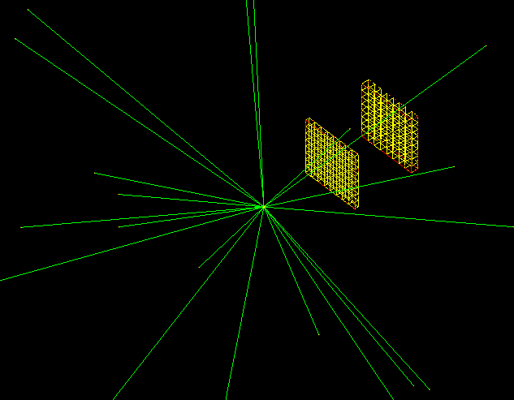

# README (2016.11.11)
Sample geometry: Compton camera with GAGG (Geant4 4.9.6.p03 code)
- - - - - - - - - - - - - - - - - - - - - - 
## History
 - 2016.11.11 created  
 - 2018.9.6. revised  
 
- - - - - - - - - - - - - - - - - - - - - - 
## 1) Build & Run 
 See **2_HowToBuild.pdf**.

## 2) Geometry

 A Compton ring consists of two modules with inner diameter 20 cm and outer diameter 39 cm in atrmospheric air.
 Each module has a scatter box (**Scabox**) and an absorber box (**Absbox**).

 Scabox consists of 8x8 scatter voxels (**scavoxel**), which is 5x10x10mm.
 Absbox consists of 8x8 scatter voxels (**absvoxel**), which is 10x10x10mm.
 The distance between Scabox and the origin is 10 cm.
 The distance between Scabox and Absbox is 8 cm.
 (See source files for more information about GAGG properties and detail geometry.)

 Both scavoxel and absvoxel are assign as “sensitive detector”. (See Geant4 guidance documents)

## 3) Source

 Point source: uniform irradiation of Cs-137 at the origin (0,0,0)

## 4) Output Data
 Use **result.txt**, which is raw data of geant4 Simulation.
 (See 3_AboutCode and the corresponding source files for more information about data properties.)
- - - - - - - - - - - - - - - - - - - - - - 
